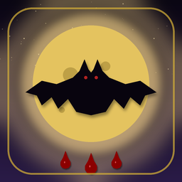

<div align="center">



# 🦇 Vampir Köylü

**Karanlık bir köyde gerçeği arayan, klasik Mafya / Werewolf türünde mobil sosyal çıkarım oyunu.**

[](https://github.com/Aliceylan11/vampir-koylu/releases)
[](https://flutter.dev)
[](https://dart.dev)
[](LICENSE)
[](https://github.com/Aliceylan11/vampir-koylu/actions/workflows/build-apk.yml)

</div>

---

## 📖 Hakkında

Vampir Köylü, **5–20 kişilik** arkadaş gruplarının tek bir telefon etrafında oynayabileceği,
**pass-and-play** mantığıyla çalışan bir mobil sosyal çıkarım oyunudur. Uygulama hem anlatıcı
hem de oyun yöneticisi rolünü üstlenir: rolleri dağıtır, gece eylemlerini gizlice toplar,
sabaha dramatik anlatımlar yapar ve oylama akışını yönetir.

Telefon bir araç değil, **interaktif bir hikâye anlatıcısıdır**.

---

## ✨ Özellikler

- 🎭 **23 farklı rol** — köy, vampir ve bağımsız taraflar
- 🎲 **14 özel olay** — Dolunay, Veba, Karnaval, Karanlık Ritüel, Kan Yağmuru…
- 🌙 **Atmosferik gotik tema** — gece moru / kan kırmızısı / eski altın paleti
- ⏱️ **Ayarlanabilir tartışma süresi** — 1 dakika ile 10 dakika arası
- 🎯 **Hazır rol kompozisyonları** — 5'ten 16 oyuncuya kadar 6 preset
- 🔧 **Özel rol seçimi** — kendi karışımını kur
- 📱 **Tüm Android cihazlarda** — 5.0 (Lollipop) ve üzeri
- 🔌 **Tamamen offline** — internet bağlantısı gerekmez
- 🇹🇷 **Türkçe arayüz** — gelecek sürümde çoklu dil desteği

---

## 📱 Kurulum

### Hazır APK ile (önerilen)

1. [**Releases**](https://github.com/Aliceylan11/vampir-koylu/releases) sayfasına gidin
2. Son sürümden cihazınıza uygun APK'yı indirin:
   - `app-arm64-v8a-release.apk` — modern telefonlar (önerilen)
   - `app-armeabi-v7a-release.apk` — eski Android cihazlar
   - `app-x86_64-release.apk` — emülatör
3. APK'yı telefona aktarın (Google Drive, WhatsApp, Telegram veya USB)
4. Telefonda dosyayı açın → *"Bilinmeyen kaynaklardan yükleme"* iznini verin
5. Yükle → uygulama menünüzde belirir

### Kaynak koddan derleme

Geliştirici kurulumu için: [SETUP.md](SETUP.md)

---

## 🎮 Oyun Akışı

```
┌────────────────────┐
│  Oyuncu Hazırlığı  │  Oyuncu sayısı, isim girişi
└──────────┬─────────┘
           ▼
┌────────────────────┐
│   Rol Dağıtımı     │  Telefon sırayla her oyuncuya gizlice gösterilir
└──────────┬─────────┘
           ▼
┌────────────────────┐
│     İlk Gece       │  Vampirler birbirini tanır, görücü ilk hedefini seçer
└──────────┬─────────┘
           ▼
┌────────────────────┐ ◄──┐
│    Gece Fazı       │    │
│  • Vampir saldırısı│    │
│  • Görücü, Doktor  │    │
│  • Cadı, Bekçi…    │    │
│  • Özel olay (%20) │    │
└──────────┬─────────┘    │
           ▼              │
┌────────────────────┐    │
│   Sabah Anlatımı   │    │
└──────────┬─────────┘    │
           ▼              │
┌────────────────────┐    │
│  Tartışma + Oylama │    │
└──────────┬─────────┘    │
           ▼              │
┌────────────────────┐    │
│       Linç         │────┘
└──────────┬─────────┘
           ▼
    Kazanan belirlenene kadar
```

---

## 👥 Roller

### 🏘️ Köy Tarafı

| Rol | Yetenek |
|---|---|
| Köylü | Tartışmaya katılır, oy verir |
| Görücü | Her gece bir oyuncunun rolünü öğrenir |
| Doktor | Her gece bir oyuncuyu saldırıdan korur |
| Avcı | Öldüğünde bir kişiyi yanında götürür |
| Cadı | Bir hayat iksiri + bir ölüm iksiri |
| Köy Bekçisi | Bir evi korur (bilgi vermeden) |
| Muhtar | Oyu çift sayılır |
| Aşık | Eşi ölürse o da ölür |
| Komşu | İki yanındaki komşunun rolünü bilir |
| Medyum | Ölü oyuncuların rollerini görür |
| Rahip | Ölü birinin rolünü tüm köye açıklar (1×) |
| Suikastçi | Bir gece bir kişiyi öldürebilir (1×) |
| Kahraman | İlk vampir saldırısını atlatır |

### 🦇 Vampir Tarafı

| Rol | Yetenek |
|---|---|
| Vampir | Geceleri toplu kurban seçer |
| Vampir Lord | Vampirlerin lideri; ölünce taç başkasına geçer |
| Genç Vampir | 2. geceden itibaren saldırıya katılır |
| Vampir Ajan | Görücüye *"Köylü"* olarak görünür |
| Hipnotizör | Bir köylüyü gündüz konuşmaktan men eder |
| Vampir Görücü | Vampirlerin kâhini, rol görür |

### 👻 Bağımsız (Üçüncü Taraf)

| Rol | Hedef |
|---|---|
| Soytarı | **Linç edildiğinde** tek başına kazanır |
| Kurt Adam | Herkesi öldürerek son ayakta kalan olur |
| Hayalet | Gizli görevini tamamlarsa dirilir ve kazanır |
| Şeytan Tapan | Vampir kim olduğunu bilir; vampir kazanırsa o da kazanır |

---

## 🎲 Özel Olaylar

Her gece %20 ihtimalle tetiklenir, oyuna tahmin edilemezlik katar:

| Olay | Etki |
|---|---|
| 🌕 Dolunay | Vampirler 2 kişi öldürebilir |
| 🎭 Karnaval | O gün linç yapılmaz |
| 🦠 Veba Salgını | Rastgele 1 oyuncu sabaha ölü bulunur |
| 💕 Aşk Gecesi | İki rastgele oyuncu aşık olur |
| 🌪️ Fırtına | Doktor ve Bekçi güçleri çalışmaz |
| 👻 Hayalet Konseyi | Ölüler anonim mesaj gönderir |
| 🔮 Kehanet | Görücü 2 kişi kontrol eder |
| 🌹 Gizli Aşık | Anonim aşk mektubu dolaşır |
| ⚔️ Düello | İki rastgele oyuncu düello eder |
| 🕯️ Karanlık Ritüel | Vampir bir köylüyü çevirmeye çalışır |
| 🌒 Kayıp Gece | Özel rollerin güçleri çalışmaz |
| 🦉 Bilge Baykuş | Köye doğru bir ipucu verilir |
| 🩸 Kan Yağmuru | Vampir sayısı tüm köye açıklanır |
| 🕊️ Affediliş | Oylama sıfırlanır, herkes baştan tartışır |

---

## 🛠️ Teknoloji

- **[Flutter](https://flutter.dev)** 3.27+ — UI framework
- **[Dart](https://dart.dev)** 3.6+ — programlama dili
- **[Riverpod](https://riverpod.dev)** — state management
- **[Google Fonts](https://pub.dev/packages/google_fonts)** — Cinzel (gotik) + Lora (gövde) tipografi
- **[flutter_animate](https://pub.dev/packages/flutter_animate)** — geçiş animasyonları
- **[Hive](https://pub.dev/packages/hive)** — yerel veritabanı (oyun geçmişi)
- **[GitHub Actions](https://github.com/features/actions)** — otomatik CI/CD ve APK üretimi

---

## 📂 Proje Yapısı

```
vampir-koylu/
├── lib/
│   ├── main.dart                    Uygulama giriş noktası
│   ├── app.dart                     MaterialApp, tema
│   ├── core/theme/                  Renk paleti ve tipografi
│   ├── models/
│   │   ├── player.dart              Oyuncu sınıfı
│   │   ├── role.dart                Soyut rol sınıfı
│   │   ├── game_state.dart          Anlık oyun durumu
│   │   ├── game_event.dart          Özel olay enum'u
│   │   └── roles/                   23 ayrı rol implementasyonu
│   ├── game_engine/
│   │   ├── game_controller.dart     Oyun akış kontrolü
│   │   ├── role_assigner.dart       Rol dağıtım algoritması
│   │   ├── night_resolver.dart      Gece eylemlerini birleştirme
│   │   ├── win_checker.dart         Kazanma koşulu kontrolü
│   │   └── event_generator.dart     Rastgele olay üretici
│   ├── providers/                   Riverpod state providers
│   ├── screens/                     9 ekran (Home, Setup, Night…)
│   └── widgets/                     Yeniden kullanılabilir bileşenler
├── assets/icon/                     Uygulama ikonları (kaynak)
├── android/                         Android platform yapılandırması
├── tool/generate_icon.py            İkon üretici script
└── .github/workflows/build-apk.yml  CI: otomatik APK üretimi
```

---

## 🏗️ Mimari

Uygulama **Model–Provider–View** yaklaşımıyla geliştirilmiştir:

- **Modeller** (`lib/models/`) — saf veri sınıfları, framework'e bağımsız
- **Oyun Motoru** (`lib/game_engine/`) — saf Dart oyun mantığı, UI'dan tamamen ayrı
- **Provider'lar** (`lib/providers/`) — Riverpod ile reactive state yönetimi
- **Ekranlar** (`lib/screens/`) — Flutter UI

Her rol **Strategy Pattern** ile kendi `performNightAction()` metodunu tanımlar.
Bu sayede yeni roller eklemek mevcut kodu değiştirmeden mümkündür.

---

## 🤝 Katkıda Bulunma

Pull request'ler memnuniyetle karşılanır. Büyük değişiklikler için lütfen önce bir issue açın.

Yeni bir rol eklemek için:

1. `lib/models/roles/` altında yeni bir dosya oluşturun (örn. `cupido.dart`)
2. `Role` sınıfını miras alın ve gerekli alanları tanımlayın
3. `lib/models/roles/roles.dart` index dosyasına ekleyin
4. `lib/models/roles_catalog.dart` içindeki `RolesCatalog.all` listesine ekleyin
5. Test ve PR

---

## 📜 Lisans

Bu proje **MIT Lisansı** altında dağıtılmaktadır. Detaylar için [LICENSE](LICENSE) dosyasına bakın.

---

## 🙏 Teşekkürler

- Klasik **Mafya** ve **Werewolf** oyunlarının yaratıcılarına ilham için
- **Flutter** ekibine harika framework için
- **Google Fonts** üzerinden Cinzel ve Lora tipografisinin tasarımcılarına

---

<div align="center">

**🦇 İyi oyunlar, dikkat — gece çöktü...**

</div>
